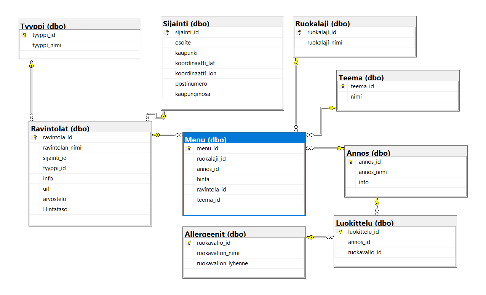

# MakuHaku 
### // SQL, JavaSript, JQuery, AJAX, Bootstrap, HTML & CSS

## Overview

The Makuhaku project is an application designed to help users find restaurants that cater to specific dietary needs. The application provides a user-friendly interface where individuals can search for restaurants based on their location and dietary preferences. The project includes a backend database containing restaurant information, menu items, allergens, prices etc.

  

## Features

Search Functionality: Users can search for restaurants by city and filter results based on selected dietary preferences (e.g., vegetarian, gluten-free, etc.).
Restaurant Details: Each restaurant's detailed information is available, including the name, review, dietary options, address, and menu items.
Real-Time Filtering: The system filters and returns only restaurants that match the selected dietary preferences.
API Integration: The project communicates with a backend API that provides the restaurant data from a SQL database. The database contains detailed information about restaurants, their menu items, allergens, and prices.

## Tech Stack

Backend: SQL Server for storing restaurant and menu data, and an API built to interact with this data.
Frontend: HTML, CSS, JavaScript (jQuery), and AJAX for the dynamic user interface.
API: The application communicates with API to retrieve restaurant information based on user queries.

## Database Schema

The project uses a SQL Server database that stores the following tables:

  

## How It Works

User Search: The user enters a city name into the search bar and selects dietary preferences (e.g., gluten-free, vegan).
API Request: The application sends a request to the API, which queries the database to find restaurants that match the city and selected dietary preferences.
Displaying Results: The results are displayed on the web page, showing a list of matching restaurants with their details.
Restaurant Details: Users can click on a restaurant to view more information about the menu, allergens, and pricing.

## Project Limitations
Due to the proprietary nature of the code used in the project, I cannot share the source code.
